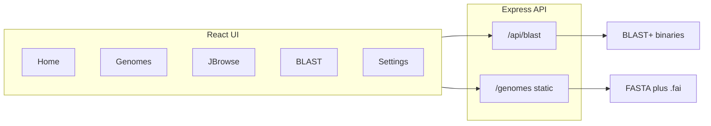

# Roseobase

Roseobase is a **local genomic resource** for marine **Roseobacteraceae**. It combines a React web front end with a small **Node.js / Express** backend that:

- Serves genome FASTA files and optional GFF annotations for **JBrowse 2**
- Runs **NCBI BLAST+** on your machine against BLAST databases you provide

You can run it **in the browser during development** (Vite + API server) or as a **desktop app** via **Electron** (recommended for choosing a custom data folder on your computer).

---

## What this application does

| Area | Purpose |
|------|--------|
| **Backend API** (`src/server`) | Serves `/genomes/...` static sequence data, exposes REST endpoints under `/api/blast` for genome scanning, BLAST jobs, database listing, and data-folder health checks. |
| **Front end** (`src`) | Single-page app: landing page, genome inventory, embedded JBrowse 2, BLAST form and results, and settings (desktop). |

### Data flow (high level)



---

## Download and run locally

### Prerequisites

- **Node.js** (current LTS, e.g. v20 or v22) and **npm**
- **NCBI BLAST+** executables on your **`PATH`** when using `npm run dev:server` (commands such as `blastn`, `blastp`, `makeblastdb`, etc.)
- Genome data as described in [Data layout](#data-layout) below

### 1. Get the code

```bash
git clone https://github.com/hunter-powell/Roseobase.git
cd Roseobase
npm install
```

If you use SSH:

```bash
git clone git@github.com:hunter-powell/Roseobase.git
cd Roseobase
npm install
```

### 2. Add genome and BLAST data

See [Data layout](#data-layout). At minimum you need indexed FASTAs (`.fa` or `.fna` plus matching **`.fai`**) under `public/genomes/` and BLAST databases under `blastdb/` at the project root (or under a custom data directory in Electron).

To index a FASTA (example):

```bash
samtools faidx public/genomes/YourGenome.fna
```

### 3. Choose how to run

#### Option A — Desktop (Electron, full features)

Starts the Vite dev server, then opens Electron. The embedded app starts the API in the main process and can use **Settings** to pick a data directory.

```bash
npm run dev
```

#### Option B — Web only (two terminals)

Terminal 1 — front end (proxies `/api` and `/genomes` to the API):

```bash
npm run dev:web
```

Terminal 2 — API server (default port **3001**):

```bash
npm run dev:server
```

Then open the URL Vite prints (usually **http://localhost:5173**).

Optional: change the API port:

```bash
PORT=3001 npm run dev:server
```

If you change the port, update `vite.config.js` proxy targets to match.

#### Option C — Production-like static build + API

Build the UI, then serve the API and open the built files (you would typically serve `dist/` with the same host as the API or configure CORS; the Electron packaged app loads `dist/index.html` locally while the API listens on localhost).

```bash
npm run build
npm run dev:server
# Serve dist/ with a static server or use Electron after build
```

Preview the built site only (API features that need the backend will not work unless the API is running and URLs are aligned):

```bash
npm run preview
```

---

## Data layout

The server looks for data in this order:

1. **Electron custom folder** (if set in **Settings**):  
   - `your-data-dir/genomes/` — FASTA / GFF files  
   - `your-data-dir/blastdb/` — BLAST database files (see below)

2. **Project defaults** (always used as fallback for genomes when present):  
   - `public/genomes/` — `.fa` / `.fna` plus **`.fai`** for each assembly; optional **`<same-basename>.gff`** for gene tracks  
   - `blastdb/` at the **repository root** — BLAST databases

### Genomes

- Filenames **`*.fa`** or **`*.fna`** are treated as assemblies.  
- Each assembly must have a **`.fai`** index in the same folder or it is listed as “unindexed” on the **Genomes** page and **excluded from JBrowse** until you index it.  
- If a **`.gff`** file with the same basename as the assembly FASTA exists next to it (for example `MyGenome.gff` beside `MyGenome.fna`), the app adds a **GFF3 annotation track** for that assembly in JBrowse.

### BLAST databases

- Place BLAST nucleotide/protein databases under `blastdb/` (or under `blastdb/` inside your Electron data directory).  
- The server discovers databases by listing **`.nin`** files (typical BLAST DB index suffix).  
- The BLAST UI can run against **one selected database** or **ALL** databases (results merged and capped by max target sequences).

### Packaged desktop builds (optional)

For `npm run dist:mac` / `npm run dist:win`, BLAST binaries can be bundled under `blast-bin/` using the script in the repo:

```bash
bash blast-bin/download-blast.sh
```

That populates platform-specific folders used by **electron-builder** `extraResources`. The running Electron app passes that directory to the server so BLAST does not need to be on the system `PATH`.

---

## Functionality by tool / page

### Home (`/`)

Landing page for Roseobase: short scientific context for Roseobacteraceae, navigation to **Genomes**, **BLAST**, and **JBrowse**, sponsor/footer imagery (from `src/assets/` when present), and contact lines for the project.

### Genomes (`/genomes`)

- Fetches the list of assemblies from **`GET /api/blast/scan-genomes`**.  
- Shows each genome with a readable display name and the underlying file base name.  
- **Ruegeria pomeroyi DSS-3** is sorted first when present.  
- If FASTA files exist **without** a `.fai`, shows a **warning** and suggests `samtools faidx`.  
- Fixed **“View Genomes”** control opens JBrowse with a default query for **Ruegeria_pomeroyi_DSS-3** (you can change the assembly via JBrowse or URL; see JBrowse below).

### JBrowse (`/jbrowse`)

- Embeds **[JBrowse 2](https://jbrowse.org/jb2/)** (`@jbrowse/react-app2`) with a **linear genome view**.  
- Configuration is **generated dynamically** from disk: assemblies and optional GFF tracks come from the same scan as the Genomes page.  
- **Query parameters**  
  - **`?genome=<assemblyName>`** — assembly to open (must match the base name derived from the FASTA file, e.g. `Ruegeria_pomeroyi_DSS-3`).  
  - **`?loc=<location>`** — optional JBrowse location string (e.g. a region) when supported by the session.  
- In development, sequence and GFF URLs are rewritten to hit the local API base so the browser can load data from the Express server.

### BLAST (`/blast`)

Local **NCBI BLAST+** search (not the NCBI website):

- **Sequence** — paste query sequence (FASTA supported in the textarea).  
- **Program** — `blastn`, `blastp`, `blastx`, `tblastn`, `tblastx`.  
- **Database** — choose one BLAST DB discovered under `blastdb/`, or **ALL** to search every DB and merge hits (sorted by E-value / bit score, truncated to max targets).  
- **Parameters** — E-value threshold, max target sequences, optional word size. For **blastn**, the form includes a **Megablast** checkbox (the current API invocation does not pass BLAST `-task`; extend `blast-api.js` if you need megablast semantics on the command line).  
- **Results** — tabular **outfmt 6**-style output rendered in the UI with parsing for hit descriptions (e.g. protein function / location hints when present in titles).

The handler lives in `src/server/blast-api.js` (`POST /api/blast`, `GET /api/blast/blastdbs`, etc.).

### Settings (`/settings`)

- **Electron only:** choose a **data directory** that contains `genomes/` and `blastdb/`. The app restarts the embedded API server with that path.  
- **Data status:** refreshes **`GET /api/blast/data-status`** to show whether genomes and BLAST DB folders were found and rough counts.  
- **Browser-only dev:** folder picker is unavailable; the app uses the project’s `public/genomes` and `blastdb` paths as configured in the server.

### Navigation bar

On all routes except Home: links to **Home**, **Genomes Available**, **NCBI Blast**, **JBrowse**, and **Settings**.

---

## Other npm scripts

| Script | Description |
|--------|-------------|
| `npm run lint` | Run ESLint on the project. |
| `npm run dist` | Build Vite output and package Electron for **macOS and Windows** (requires platform tooling / machines as appropriate). |
| `npm run dist:mac` | Build + macOS artifacts (e.g. `.dmg`, `.zip` under `release/`). |
| `npm run dist:win` | Build + Windows NSIS installer. |

---

## Project structure (short)

| Path | Role |
|------|------|
| `electron/main.js` | Electron main process: window, IPC, starts Express backend. |
| `electron/preload.js` | Exposes safe APIs to the renderer (`electronAPI`). |
| `src/server/index.js` | Express app entry: static `/genomes`, mounts BLAST router. |
| `src/server/blast-api.js` | BLAST execution, DB listing, genome scan, data status. |
| `src/pages/` | Route-level pages (Home, Genomes, Blast, JBrowse, Settings). |
| `src/components/` | BLAST UI, JBrowse wrapper, navbar. |
| `public/genomes/` | Default location for bundled or dev genome FASTA/GFF. |
| `blastdb/` | Default BLAST database directory. |

---

## Troubleshooting

- **“No genomes found” / JBrowse empty** — Add FASTA files under `public/genomes` or your Electron data `genomes/` folder and ensure each has a **`.fai`**.  
- **BLAST errors** — Confirm BLAST+ is installed and on `PATH` for `dev:server`, or use a packaged Electron build with `blast-bin` populated.  
- **CORS / wrong API in browser** — Use `npm run dev:web` so Vite proxies `/api` and `/genomes` to the server defined in `vite.config.js`.  
- **Genomes page shows databases but BLAST fails** — Check `blastdb/` contains complete DB sets (e.g. `.nin`, `.nhr`, and related BLAST files).

---

## License and attribution

Add your preferred **LICENSE** file and citation text for the Roseobase resource if you distribute this repository publicly.

For JBrowse 2, see [JBrowse 2 documentation](https://jbrowse.org/jb2/docs/) for citation and licensing of the embedded browser component.
